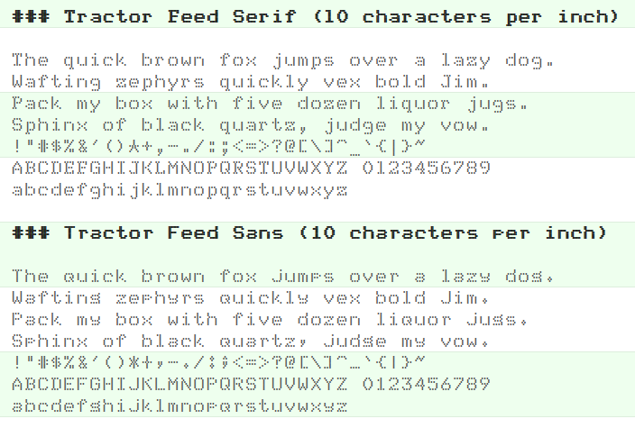
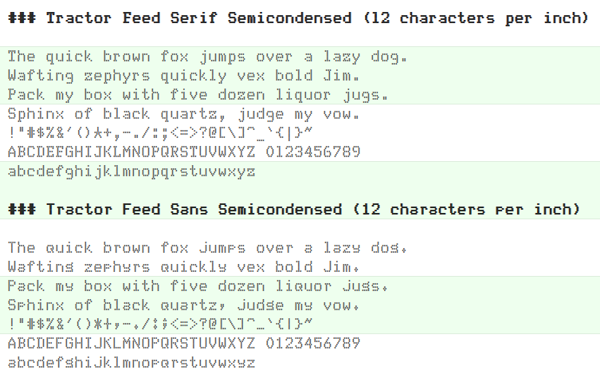
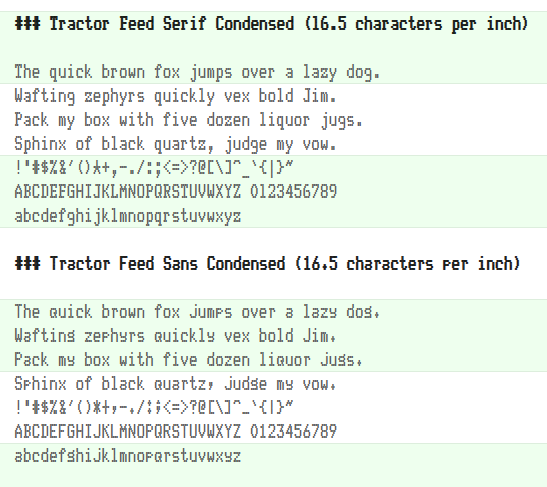

# Tractor Feed Fonts

https://webonastick.com/fonts/tractorfeed/

**Tractor Feed Serif** is based on draft-mode DEC LA100 and DEC LA210
output.  **It's the best dot matrix printer font ever.**  (Objective
fact!)

**Tractor Feed Sans** is based on draft-mode DEC LA120 output.  It
looks more like a typical dot matrix printer font.

## License

[SIL OFL 1.1](LICENSE.md)
